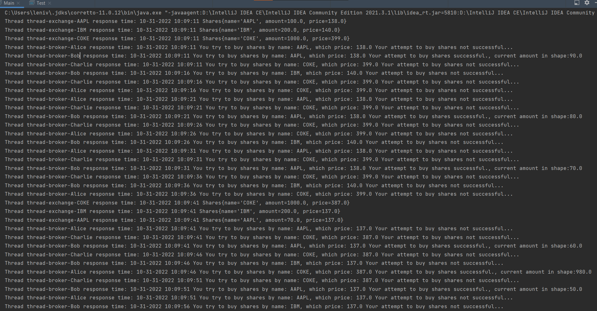
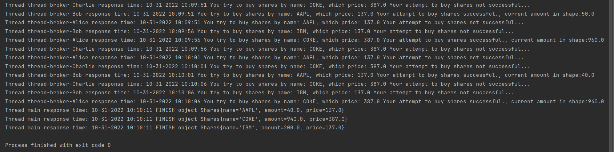

# Exchange Simulator

## Preview
1. This project uses jdk 8;
2. Result program you can see in console.
3. We use in project multithreading.
4. The input values   are set in the code and describe the shares, which are traded on the stock exchange:
```java   
    Share shares1 = new Share("AAPL", 100, 141);
    Share shares2 = new Share("COKE", 1000, 387);
    Share shares3 = new Share("IBM", 200, 137);
   ```
5. Buyer parameters are also set:
```java
        Buyer buyer1 = new Buyer("Alice", new Share[]{
                new Share("AAPL", 10, 100),
                new Share("COKE", 20, 390)
        });

        Buyer buyer2 = new Buyer("Bob", new Share[]{
                new Share("AAPL", 10, 140),
                new Share("IBM", 20, 135)
        });

        Buyer buyer3 = new Buyer("Charlie", new Share[]{
                new Share("COKE", 300, 370)
        });
```
6. The shares of each company can serve a separate flow of the exchange, which once in 30 seconds should change the share price, randomly, within 3% (in any direction).
7. Each buyer is also served by a separate flow-broker who must safely refer to the data on the current share price and, given the buyer's settings, purchase the required number of shares or continue to wait. 
8. Buyer streams should make purchase attempts every 5 seconds. 
9. Each thread must report its results to the console at each step.

## Program testing
### Result of running the program for 60 seconds

